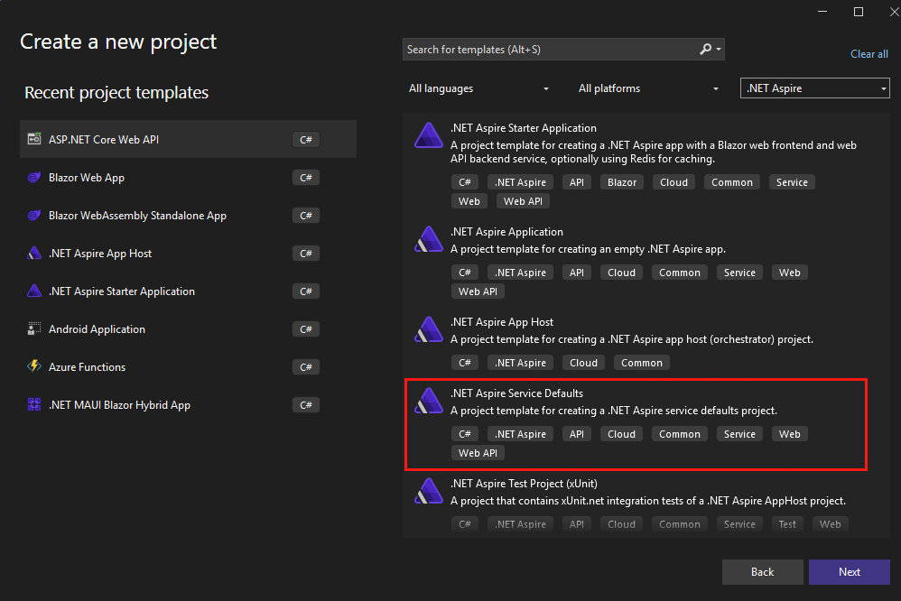
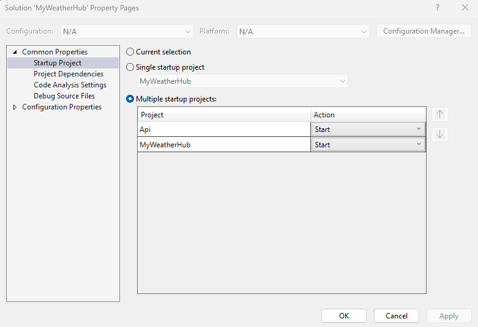

# Service Defaults aka Smart Defaults

## Introduction
.NET Aspire provides a set of smart defaults for services that are commonly used in .NET applications. These defaults are designed to help you get started quickly and provide a consistent experience across different types of applications. This includes:

- Telemetry: Metrics, Tracing, Logging
- Resiliency
- Health Checks
- Service Discovery

## Create Service Defaults Project

### Visual Studio & Visual Studio Code

1. Add a new project to the solution called `ServiceDefaults`:

	- Right-click on the solution and select `Add` > `New Project`.
	- Select the `.NET Aspire Service Defaults` project template.
	- Name the project `ServiceDefaults`.
	- Click `Next` > `Create`.

	*Visual Studio*
	]

	*Visual Studio Code*
	]


### Command Line

1. Create a new project using the `dotnet new aspire-servicedefaults` command:

	```bash
	dotnet new aspire-servicedefaults -n ServiceDefaults
	```

## Configure Service Defaults

1. Add a reference to the `ServiceDefaults` project in the `Api` and `MyWeatherHub` projects:

	- Right-click on the `Api` project and select `Add` > `Reference`.
	- Check the `ServiceDefaults` project and click `OK`.
	- - Right-click on the `Api` project and select `Add` > `Reference`.
	- Check the `MyWeatherHub` project and click `OK`.

	> Pro Tip: In Visual Studio 2022, you can drag and drop the project onto another project to add a reference.

1. In both the `Api` and `MyWeatherHub` projects, update their `Program.cs` files, adding the following line immediately after their `var builder = WebApplication.CreateBuilder(args);` line:
	
	```csharp
	builder.AddServiceDefaults();
	```
1. In both the `Api` and `MyWeatherHub` projects, update their `Program.cs` files,adding the following line immediately after their `var app = builder.Build();` line:

	```csharp
	app.MapDefaultEndpoints();
	```

## Run the application

1. Run the application using a multip-project launch configuration in Visual Studio or Visual Studio Code.

	- Visual Studio: Right click on the `MyWeatherHub` solution and go to properties. Select the `Api` and `MyWeatherHub` as startup projects, select `OK`. 
		- 
		- Click `Start` to start and debug both projects.
	- Visual Studio Code: Run the `Api` and `MyWeatherHub` projects using the `Run and Debug` panel. We have provided a `launch.json` file with the necessary configurations to run both.

1. Test the application by navigating to the following URLs:

	- [https://localhost:7032/swagger/index.html](https://localhost:7032/swagger/index.html) - API
	- [https://localhost:7274/](https://localhost:7274/) - MyWeatherHub

1. You should see the Swagger UI for the API and the MyWeatherHub home page.
1. You can also view the health checks for the API by navigating to [https://localhost:7032/health](https://localhost:7032/health).
1. You can also view the health checks for the MyWeatherHub by navigating to [https://localhost:7274/health](https://localhost:7274/health).
1. View the logs in the terminal to see the health checks and other telemetry data such as resiliency with Polly:

	```cli
	Polly: Information: Execution attempt. Source: '-standard//Standard-Retry', Operation Key: '', Result: '200', Handled: 'False', Attempt: '0', Execution Time: '13.0649'
	```
1. Click on 5 different cities and a "random" error will be thrown. You will see the Polly retry policy in action.

	```cli
	Polly: Warning: Execution attempt. Source: '-standard//Standard-Retry', Operation Key: '', Result: '500', Handled: 'True', Attempt: '0', Execution Time: '9732.8258'
	Polly: Warning: Resilience event occurred. EventName: 'OnRetry', Source: '-standard//Standard-Retry', Operation Key: '', Result: '500'
	System.Net.Http.HttpClient.NwsManager.ClientHandler: Information: Sending HTTP request GET http://localhost:5271/forecast/AKZ318
	```