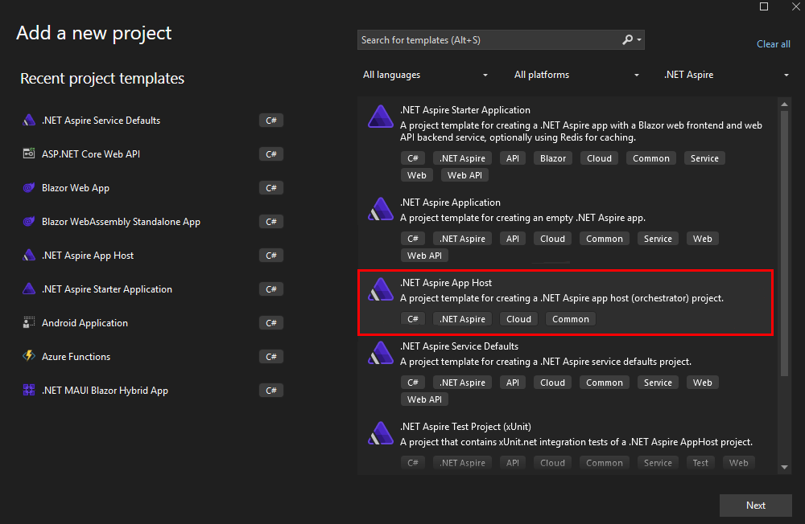
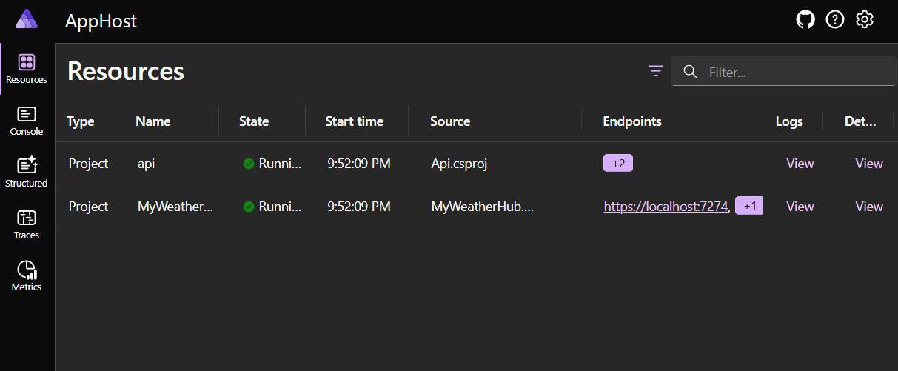
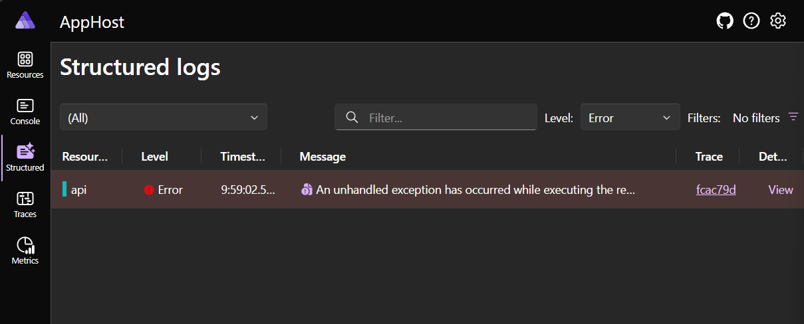

# Painel de Controle & Orquestração com .NET Aspire App Host

.NET Aspire fornece APIs para apresentar recursos e dependências dentro da sua aplicação distribuída. Além dessas APIs, há ferramentas que possibilitam alguns cenários interessantes. O orquestrador é destinado para fins de desenvolvimento local.

Antes de continuar, considere alguns termos comuns usados no .NET Aspire:

* *Modelo de aplicativo*(App model): Uma coleção de recursos que compõem sua aplicação distribuída (DistributedApplication). Para uma definição mais formal, veja Definir o modelo de aplicativo.
* *Projeto do host da aplicação/Orquestrador*(App host/Orchestrator project): O projeto .NET que orquestra o modelo de aplicativo, nomeado com o sufixo *.AppHost (por convenção).
* *Recurso*(Resource): Um recurso representa uma parte de uma aplicação, seja um projeto .NET, contêiner, ou executável, ou algum outro recurso como um banco de dados, cache, ou serviço na nuvem (como um serviço de armazenamento).
* *Referência*(Reference): Uma referência define uma conexão entre recursos, expressa como uma dependência usando a API WithReference. Para mais informações, veja Recursos de referência.

## Crie um Projeto do Host da Aplicação

### Visual Studio & Visual Studio Code

1. Adicione um novo projeto à solução chamado `AppHost`:

    - Clique com o botão direito na solução e selecione `Add` > `New Project`.
    - Selecione o modelo de projeto `.NET Aspire App Host`.
    - Nomeie o projeto como `AppHost`.
    - Clique em `Next` > `Create`.

    *Visual Studio*
    

    *Visual Studio Code*
    

### Linha de Comando

1. Crie um novo projeto usando o comando `dotnet new aspire-apphost`:

	```bash
	dotnet new aspire-apphost -n AppHost
    ```

## Configure Padrões de Serviço (Service Defaults)

1. Adicione as referências dos projetos `Api` e `MyWeatherHub` no novo projeto `AppHost`:
    - Clique com o botão direito no projeto `AppHost` e selecione `Add` > `Reference`.
        - Marque os projetos `Api` e `MyWeatherHub` e clique em `OK`.

    > Dica: No Visual Studio 2022, você pode arrastar e soltar o projeto em outro projeto para adicionar uma referência.
1. Quando essas referências são adicionadas, os seradores de código automaticamente geram o código necessário para referenciar os projetos no Host da Aplicação.

## Orquestre a aplicação

1. No projeto `AppHost`, atualize o arquivo `Program.cs`, adicionando a seguinte linha imediatamente após a linha `var builder = DistributedApplication.CreateBuilder(args);`:

    ```csharp
	var api = builder.AddProject<Projects.Api>("api");

	var web = builder.AddProject<Projects.MyWeatherHub>("myweatherhub");
    ```

## Execute a aplicação

1. Defina o projeto `AppHost` como o projeto de inicialização no Visual Studio clicando com o botão direito no `AppHost` e clicando em `Set Defaul Project`.
1. Se você estiver usando o Visual Studio Code, abra o `launch.json` e substitua todo o conteúdo pelo seguinte:
    ```json
	{
        "version": "0.2.0",
        "configurations": [
            {
                "name": "Run AppHost",
                "type": "dotnet",
                "request": "launch",
                "projectPath": "${workspaceFolder}\\AppHost\\AppHost.csproj"
            }
        ]
    }
    ```
1. Execute o Host da Aplicação usando o painel `Run and Debug` no Visual Studio Code ou Visual Studio.
1. O Painel do .NET Aspire será aberto no seu navegador padrão e exibirá os recursos e dependências da sua aplicação.

    
1. Abra o painel da aplicação Weather clicando no Endpoint para o `MyWeatherHub` que será [https://localhost:7274](https://localhost:7274).
1. Observe que os projetos `Api` e `MyWeatherHub` estão rodando no mesmo processo e podem se comunicar entre si da mesma forma que antes usando configurações.
1. Clique no botão `View Logs` para ver os logs dos projetos `Api` e `MyWeatherHub`.
1. Selecione a aba `Traces` e selecione `View` em um log trace onde a API está sendo chamada.

    ]

1. Explore a aba `Metrics` para ver as métricas para os projetos `Api` e `MyWeatherHub`.

    

## Crie um erro

1. Abra a aba `Structured` no painel.
1. Defina o `Level` para `Error` e observe que nenhum erro aparece.
1. No site `MyWeatherApp`, clique em várias cidades diferentes para gerar erros. Geralmente, 5 cidades diferentes gerarão um erro.
1. Após gerar os erros, a aba `Structured` será atualizada automaticamente no painel e observe que os erros são exibidos.

    
1. Clique em `Trace` ou `Details` para ver a mensagem de erro e o log (stack trace).
